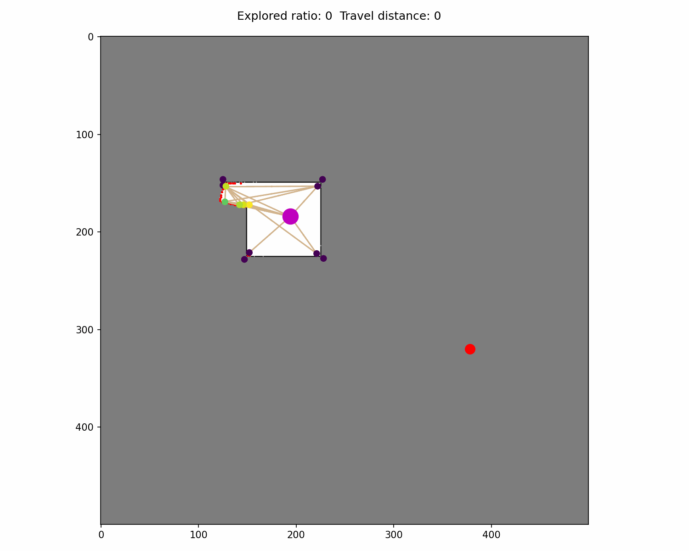
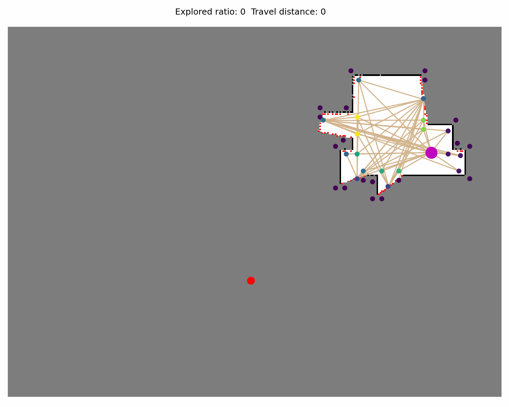

# CORE

本项目包含 CORE Planner (Contextual-memory Oriented Reinforcement-learning) 的训练代码实现。以下是配置环境和开始训练的步骤。

**注意这里仅是训练代码，ROS环境下的测试代码在：https://github.com/marmotlab/ARiADNE-ROS-Planner中。**


### Demo of CORE

<div>
   
</div>

## 0. 下载代码
下载仓库代码并进入项目文件
``` bash
git clone https://github.com/marmotlab/ARiADNE.git
cd core_planner
```

## 1. 环境配置

首先，建议使用 Conda 创建一个独立的虚拟环境，以避免依赖冲突。推荐使用 Python 3.10。

```bash
# 创建名为 core 的虚拟环境，指定 Python 版本为 3.10
conda create -n core python=3.10

# 激活环境
conda activate core
```

## 2. 安装依赖

项目根目录下提供了 requirements.txt 文件，其中列出了训练所需的所有 Python 依赖包。请在激活环境后运行以下命令进行安装：

```bash
pip install -r requirements.txt
```

*注意：如果安装过程中遇到 PyTorch 或 Ray 相关的版本问题，请根据你的 CUDA 版本去 PyTorch 官网查找对应的安装命令。*

## 3. 开始训练

训练的入口脚本是 driver.py。在运行之前，你可以根据需要修改 parameter.py 中的超参数（如学习率、GPU 设置、训练轮数等）。

运行以下命令开始训练：

```bash
RAY_DEDUP_LOGS=0 python3 driver.py
```
**注意：成功率大约在step=8000时开始增加并随后在10000时到达最高**

## 4. 项目文件说明

*   **driver.py**: 训练程序的主驱动文件，负责维护和更新全局网络。
*   **parameter.py**: 包含所有训练相关的超参数配置。
*   **worker.py**: 工作节点逻辑，负责与环境交互并收集经验。
*   **model.py**: 定义了基于注意力的深度神经网络模型结构。
*   **env.py**: 自主探索环境的定义。
*   **requirements.txt**: 项目依赖列表。

## 5. 致谢

本项目基于 ARiADNE 的代码实现。如果您觉得这项工作有帮助或有启发，请引用原作者的论文：

```bibtex
@INPROCEEDINGS{cao2023ariadne,
  author={Cao, Yuhong and Hou, Tianxiang and Wang, Yizhuo and Yi, Xian and Sartoretti, Guillaume},
  booktitle={2023 IEEE International Conference on Robotics and Automation (ICRA)}, 
  title={ARiADNE: A Reinforcement learning approach using Attention-based Deep Networks for Exploration}, 
  year={2023},
  pages={10219-10225},
  doi={10.1109/ICRA48891.2023.10160565}}